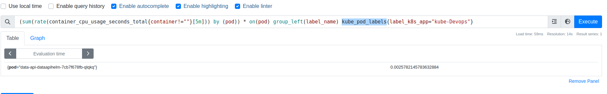

# monitoringStack

## Directory composition
- `install-monitoring.yaml` -> Ansible playbook to install the prometheus operator

## Prometheus operator
* We use the community [prometheus operator](https://github.com/prometheus-operator/kube-prometheus) for setting up the monitoring stack.
* It install the following 
    * Alertmanager
    * Grafana
    * Kube state metrics
    * Prometheus datastore
    * Prometheeus node exporter daemon set acroos all nodes in the cluster

## Ansible installation
* We run the playbook to install the monitoring stack in the kubernetes cluster 
    ```
    ansible-playbook install-monitoring.yaml
    ```

## Dashboards
* By default the operator provides grafana dashboards to see the pod and node metrics as can be seen in the pictures 

### Node dashboard


### Pod dashboard


## Accessing dashboards
* The dashboards can be accessed in an installtion by either running
    * Kubernetes port forwarding
        ```
        kubectl port-forward -n monitoring  svc/promstack-grafana 8080:80
        ```
    * Exposing the grafana pod with an ingress

## Label pod monitoring
* Labels are exposed by the `kube-state-metrics` sub chart
* We need to enable `--metric-labels-allowlist=pods=[*]` to allow the lables to be exposed as part of the metrics
* This label can be used as part of the prometheus query for the desired output using `kube_pod_labels`



